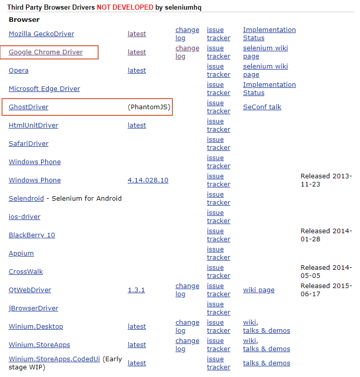

# SELENIUM 공부 

Created: Jul 08, 2019 10:28 AM
Updated: Jul 17, 2019 11:56 AM

# 1. 지원 가능한 브라우저

[Downloads](https://www.seleniumhq.org/download/)

## 주로 사용하는 브라우저

---

# 2. selenium with python

- 학습 시 사용

[2. Getting Started - Selenium Python Bindings 2 documentation](https://selenium-python.readthedocs.io/getting-started.html)

---

# 3. wait (대기)

> 화면과 화면에서 이동 시, 꼭 넣어줘야한다.

[5. Waits - Selenium Python Bindings 2 documentation](https://selenium-python.readthedocs.io/waits.html)

## 3-1. Explicit Waits(명시적 대기)

> 특정 요소가 발견될 때 까지 기다림 ⇒ 예외 처리: 해당 요소가 없을 수도 있으니깐

    element = WebDriverWait(driver, 10).until(
            # 지정한 한개 요소가 올라오면 웨이트 종료
            EC.presence_of_all_elements_located((By.CLASS_NAME, 'oTravelBox'))
        )

## 3-2. Implicit Waits(암묵적 대기)

> dom이 다 로드될 때까지 대기하고 먼저 로드되면 바로 진행

    driver.implicitly_wait(10)

## 3-3. 절대적 대기

> time.sleep(10) ⇒ 클라우드 페어(디도스 방어 솔루션)

    time.sleep(10)

# 4. 자바스크립트 구동하기

    driver.execute_script("searchModule.SetCategoryList(%s, '')" %page)
    
 # 5. element 접근

## 1) driver.find_elements_by_css_selector

> 여러개의 셀렉터를 가져온다

## 2) driver.find_element_by_css_selector

> 첫번째 만난 셀렉터를 가져온다.

# 6. 특정 attribute 가져오기

    li.find_element_by_css_selector('img').get_attribute('src')